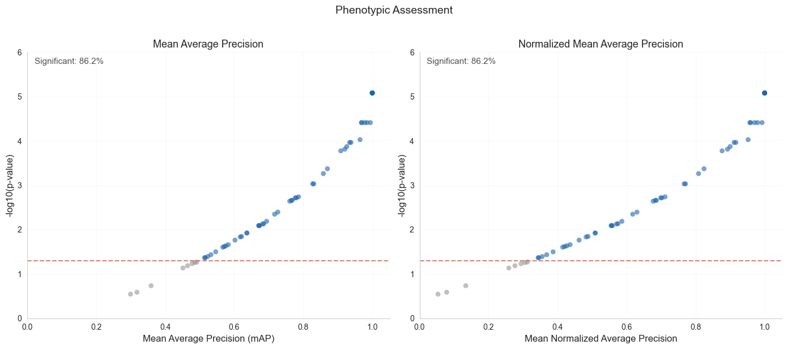

# Copairs Runner

YAML-driven runner for [copairs](https://github.com/broadinstitute/copairs).

## Usage

```bash
# Set environment variables if used in config
export COPAIRS_DATA=. COPAIRS_OUTPUT=.

# Run with a config from the configs/ directory
uv run copairs_runner.py --config-name example_activity_lincs

# Override parameters
uv run copairs_runner.py --config-name example_activity_lincs mean_average_precision.params.null_size=50000
```

### Output Files

Each analysis run generates exactly three files:
- `{name}_ap_scores.csv` - Individual average precision scores
- `{name}_map_results.csv` - Mean average precision with p-values
- `{name}_map_plot.png` - Scatter plot of mAP vs -log10(p-value)

## Configuration

### Path Resolution

The runner uses Hydra's best practices for path handling:

- **Input paths** are relative to where you run the script (original working directory)
- **Output paths** should use `${hydra:runtime.output_dir}` to save in Hydra's organized structure
- **URLs and S3 paths** are supported for data loading and metadata merging

```yaml
# Example path configuration
input:
  # Local file - relative to original CWD
  path: "${hydra:runtime.cwd}/${oc.env:COPAIRS_DATA}/input/data.csv"
  
  # URL - no changes needed
  path: "https://example.com/data.parquet"

output:
  # Output directory and base name for all files
  directory: "${hydra:runtime.output_dir}"
  name: "activity"  # Creates: activity_ap_scores.csv, activity_map_results.csv, activity_map_plot.png
```

### Hydra Output Directory

The example configs demonstrate a project-based organization:

1. **LINCS analyses** (dependent workflow):
   ```yaml
   hydra:
     run:
       dir: ${oc.env:COPAIRS_OUTPUT}/output/lincs/shared
   ```
   - Used by both `example_activity_lincs.yaml` and `example_consistency_lincs.yaml`
   - Shared directory allows consistency analysis to read activity results
   - Files are overwritten on each run (this is intentional - the consistency analysis 
     reads `activity_map_results.csv` to filter compounds)

2. **JUMP analyses** (independent runs):
   ```yaml
   hydra:
     run:
       dir: ${oc.env:COPAIRS_OUTPUT}/output/jump-target2/${now:%Y-%m-%d}/${now:%H-%M-%S}
   ```
   - Used by `example_activity_jump_target2.yaml`
   - Timestamped subdirectories preserve results from each run
   - Better for experiments and parameter sweeps

This creates a clean structure:
```
output/
├── lincs/
│   └── shared/           # LINCS workflow outputs
│       ├── activity_ap_scores.csv
│       ├── activity_map_results.csv
│       ├── activity_map_plot.png
│       ├── consistency_ap_scores.csv
│       ├── consistency_map_results.csv
│       └── consistency_map_plot.png
└── jump-target2/
    ├── 2024-01-10/      # JUMP experiment runs
    │   └── 14-23-45/
    └── 2024-01-11/
        └── 09-15-30/
```

All configs use `chdir: false` to stay in the original directory for easier debugging.

```yaml
# Required sections
input:
  path: "data.csv"  # or .parquet, URLs, S3 paths
  
  # For large parquet files - filter BEFORE loading into memory:
  # use_lazy_filter: true
  # filter_query: "Metadata_PlateType == 'TARGET2'"  # SQL syntax
  # columns: ["Metadata_col1", "feature_1", "feature_2"]  # optional

# Optional sections
preprocessing:
  steps:
    # Standard filtering - happens AFTER data is loaded:
    - type: filter
      params:
        query: "Metadata_dose > 0.1"  # pandas query syntax

average_precision:
  params:
    pos_sameby: ["Metadata_compound"]
    pos_diffby: []
    neg_sameby: []
    neg_diffby: ["Metadata_compound"]

output:
  directory: "${hydra:runtime.output_dir}"
  name: "analysis"  # Base name for outputs

mean_average_precision:
  params:
    sameby: ["Metadata_compound"]
    null_size: 10000  # Typically 10000-100000
    threshold: 0.05
    seed: 0
```

## Preprocessing Steps

- `filter`: Filter rows with pandas query
- `dropna`: Remove rows with NaN
- `aggregate_replicates`: Median aggregation by group
- `merge_metadata`: Join external CSV
- `split_multilabel`: Split pipe-separated values
- See `copairs_runner.py` docstring for complete list

## Examples

- `configs/example_activity_lincs.yaml`: Phenotypic activity
- `configs/example_consistency_lincs.yaml`: Target consistency

Run all examples: `./run_examples.sh`

## Contributing

See [CONTRIBUTING.md](CONTRIBUTING.md) for guidelines on adding preprocessing steps.

### Example Output

The runner generates scatter plots showing mean average precision (mAP) vs statistical significance:

**Phenotypic Activity Assessment:**


**Phenotypic Consistency (Target-based):**

