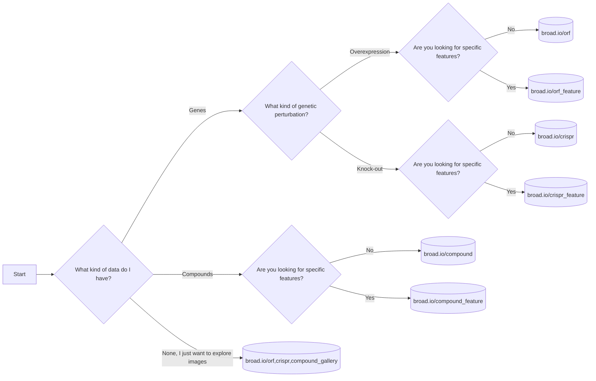

- [Decision Flowchart](#Decision%20Flowchart)
- [Quick data access](#Quick%20data%20access)
- [Overview](#Overview)
- [Data accessibility](#Data%20accessibility)
- [Installation](#Installation)
  - [pip](#pip)
  - [uv (dev)](#uv%20%28dev%29)
- [Contributions](#Contributions)


<a id="Decision%20Flowchart"></a>

# Decision Flowchart




<a id="Quick%20data%20access"></a>

# Quick data access

Use the following datasets to explore morphological similarities between gene and/or compounds.

| Dataset  | Matches                                        | Feature ranking                                             | Gallery                                                         | Description         |
|----------|------------------------------------------------|-------------------------------------------------------------|-----------------------------------------------------------------|---------------------|
| ORF      | [broad.io/orf](https://broad.io/orf)           | [broad.io/orf\_feature](https://broad.io/orf_feature)       | [broad.io/orf\_gallery](https://broad.io/orf_gallery)           | Gene overexpression |
| CRISPR   | [broad.io/crispr](https://broad.io/crispr)     | [broad.io/crispr\_feature](https://broad.io/crispr_feature) | [broad.io/crispr\_gallery](https://broad.io/crispr_gallery)     | Gene knock-out      |
| Compound | [broad.io/compound](https://broad.io/compound) | [broad.io/compound\_feature](https://broad.io/compound_feature)       | [broad.io/compound\_gallery](https://broad.io/compound_gallery) | Chemical compounds  |

Note that the feature databases are based on interpretable features. The perturbation databases use non-interpretable features, which have been processed to attenuate batch effects.

In the rare case where you experience a problem before data is loaded, it may be transient - try reloading the webpage. 

<a id="Overview"></a>

# Overview

This module provides tools to efficiently compare vectors of [JUMP](https://jump-cellpainting.broadinstitute.org/) data. It also assembles the dataframes that we make accessible through the browser using [datasette-lite](https://github.com/simonw/datasette-lite). 

You can read more about JUMP data and find other useful tools at the [JUMP-Cell Painting Hub](https://broad.io/jump).


<a id="Data%20accessibility"></a>

# Data accessibility

-   You can fetch the raw morphological profiles (before any non-image processing step) on the [Cell Painting Gallery](https://cellpainting-gallery.s3.amazonaws.com/index.html#cpg0016-jump-assembled/source_all/workspace/profiles) (CPG) under the &ldquo;profiles.parquet&rdquo; names.
-   [This](https://github.com/broadinstitute/monorepo/tree/452543be5f17a626a3964b8b90984a9502952a06/libs/jump_rr/tools/download_profiles.org) file points to the gist points to the data used to produce the final tables, if you adjust `OUTPUT_DIR` you can download the files locally.


<a id="Installation"></a>

# Installation

You do not need to install this unless you want to re-do the similarity calculations. You can use the datasette web interface provided if your goal is to explore genes. We assume that a GPU and cuda11 are available in the server where this is run. This is to use cupy, which offers vastly faster distance calculations.


<a id="pip"></a>

## pip

Use this if you want to re-analyse data. Several of the analyses require GPUs.

```python
pip install jump_rr
```


<a id="uv%20%28dev%29"></a>

## Development (uv)

Use this if you want to develop and modify the functions (requires [uv](https://docs.astral.sh/uv/))

```python
git clone https://github.com/broadinstitute/monorepo/
cd monorepo/libs/jump_rr
uv sync --all-extras
```


<a id="Contributions"></a>

# Contributions

Feel free to open an bug/request issue or submit a pull request with the `jump_rr` tag.
