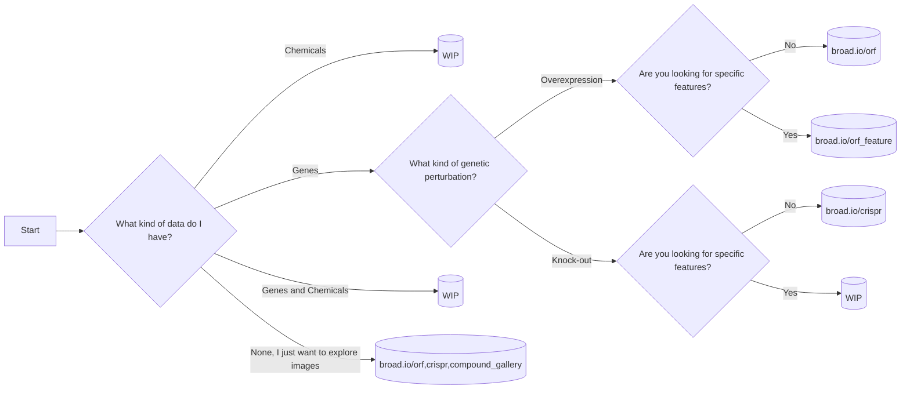

- [Decision Flowchart](#Decision%20Flowchart)
- [Quick data access](#Quick%20data%20access)
- [Overview](#Overview)
- [Data accessibility](#Data%20accessibility)
- [Installation](#Installation)
  - [pip](#pip)
  - [poetry (dev)](#poetry%20%28dev%29)
- [Contributions](#Contributions)


<a id="Decision%20Flowchart"></a>

# Decision Flowchart




<a id="Quick%20data%20access"></a>

# Quick data access

Use the following datasets to explore morphological similarities between gene and/or compounds.

| Dataset  | Perturbation simile                        | Feature ranking                                       | Gallery                                                         | Description         |
|-------- |------------------------------------------ |----------------------------------------------------- |--------------------------------------------------------------- |------------------- |
| ORF      | [broad.io/orf](https://broad.io/orf)       | [broad.io/orf\_feature](https://broad.io/orf_feature) | [broad.io/orf\_gallery](https://broad.io/orf_gallery)           | Gene overexpression |
| CRISPR   | [broad.io/crispr](https://broad.io/crispr) | [broad.io/crispr\_feature](https://broad.io/crispr)   | [broad.io/crispr\_gallery](https://broad.io/crispr_gallery)     | Gene knock-out      |
| Compound | WIP                                        | WIP                                                   | [broad.io/compound\_gallery](https://broad.io/compound_gallery) | Chemical compounds  |

Note that the feature databases are based on interpretable features. The The perturbation databases use non-interpretable features, which increase sample replicability.


<a id="Overview"></a>

# Overview

This module provides tools to efficiently compare vectors of [JUMP](https://jump-cellpainting.broadinstitute.org/) data. It also assembles the dataframes that are to be accessed by biologists using [datasette-lite](https://github.com/simonw/datasette-lite).


<a id="Data%20accessibility"></a>

# Data accessibility

The raw morphological profiles are currently in a local server. It will be provided independently and this section updated in the future.


<a id="Installation"></a>

# Installation

You do not need to install this unless you want to re-do the similarity calculations. You can use the datasette web interface provided if your goal is to explore genes. We assume that a GPU and cuda11 are available in the server where this is run. This is to use cupy, which offers vastly faster distance calculations.


<a id="pip"></a>

## pip

Use this if you want to analyse data.

```python
pip install jump_rr
```


<a id="poetry%20%28dev%29"></a>

## poetry (dev)

Use this if you want to tweak the functions

```python
git clone https://github.com/broadinstitute/monorepo/
cd monorepo/libs/jump_rr
poetry install --with dev
```


<a id="Contributions"></a>

# Contributions

Feel free to open an bug/request issue or submit a pull request with the `jump_rr` tag.
