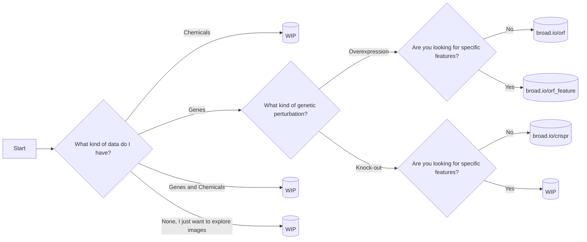

# Table of Contents

1.  [Decision flowchart](#org576d10a)
2.  [Quick data access](#qda)
3.  [Overview](#org0f22c5e)
4.  [Data accessibility](#org69be4a3)
5.  [Installation](#org539a3ea)
    1.  [pip](#org4a64c80)
    2.  [poetry (dev)](#org76d8a20)
6.  [Contributions](#orgf86efb7)

# Decision flowchart

# Quick data access

Use the following datasets to explore morphological similarities between gene and/or compounds.

<table border="2" cellspacing="0" cellpadding="6" rules="groups" frame="hsides">

<colgroup>
<col  class="org-left" />

<col  class="org-left" />

<col  class="org-left" />

<col  class="org-left" />
</colgroup>
<thead>
<tr>
<th scope="col" class="org-left">Dataset</th>
<th scope="col" class="org-left">Perturbation simile</th>
<th scope="col" class="org-left">Feature ranking</th>
<th scope="col" class="org-left">Description</th>
</tr>
</thead>

<tbody>
<tr>
<td class="org-left">ORF</td>
<td class="org-left"><a href="https://broad.io/orf">broad.io/orf</a></td>
<td class="org-left"><a href="https://broad.io/orf_feature">broad.io/orf_feature</a></td>
<td class="org-left">Gene overexpression</td>
</tr>

<tr>
<td class="org-left">CRISPR</td>
<td class="org-left"><a href="https://broad.io/crispr">broad.io/crispr</a></td>
<td class="org-left">TBD</td>
<td class="org-left">Gene knock-out</td>
</tr>

<tr>
<td class="org-left">Compound</td>
<td class="org-left">TBD</td>
<td class="org-left">TBD</td>
<td class="org-left">Chemical compounds</td>
</tr>
</tbody>
</table>

Note that the feature databases are based on interpretable features. The The perturbation databases use non-interpretable features, which increase sample replicability.

# Overview

This module provides tools to efficiently compare vectors of [JUMP](https://jump-cellpainting.broadinstitute.org/) data. It also assembles the dataframes that are to be accessed by biologists using [datasette-lite](https://github.com/simonw/datasette-lite). It is pronounced like "jumper"; RR stands for [Round-Robin](https://en.wikipedia.org/wiki/Round-robin_tournament), a tournament system in which all competitors face every other competitor.

# Data accessibility

The raw morphological profiles are currently in a local server. It will be provided independently and this section updated in the future.

# Installation

You do not need to install this unless you want to re-do the similarity calculations. You can use the datasette web interface provided if your goal is to explore genes. We assume that a GPU and cuda11 are available in the server where this is run. This is to use cupy, which offers vastly faster distance calculations.

## pip

Use this if you want to analyse data.

    pip install jump_rr

## poetry (dev)

Use this if you want to tweak the functions

    git clone https://github.com/broadinstitute/monorepo/
    cd monorepo/libs/jump_rr
    poetry install --with dev

# Contributions

Feel free to open an bug/request issue or submit a pull request with the `jump_rr` tag.

